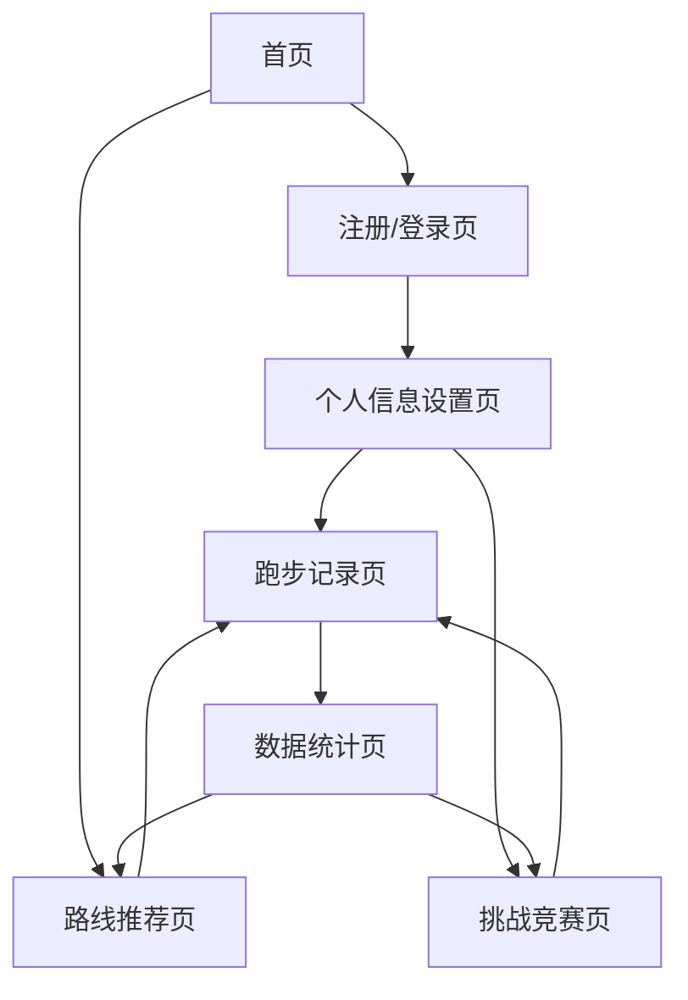

# 上海城市跑 - 产品需求文档

## 1. Product Overview
上海城市跑是一款基于网页端的跑步应用，用户可通过浏览器使用高德地图API实时记录跑步路线、时间和距离，并生成可视化数据。
通过多样化路线探索上海风光，实现娱乐与锻炼的完美结合，让用户在运动中发现城市之美。
项目旨在打造一个集运动记录、路线推荐、数据可视化于一体的城市跑步平台，提升用户的运动体验和城市探索乐趣。

## 2. Core Features

### 2.1 User Roles
| Role | Registration Method | Core Permissions |
|------|---------------------|------------------|
| 普通用户 | 邮箱注册或手机号注册 | 可记录跑步数据、查看个人统计、使用基础路线推荐 |
| 高级用户 | 付费升级或邀请码升级 | 可参与虚拟竞赛、获得高级路线推荐、查看详细数据分析 |

### 2.2 Feature Module
我们的上海城市跑应用包含以下主要页面：
1. **首页**：应用介绍、快速开始跑步、热门路线展示
2. **用户注册/登录页**：用户账户创建和身份验证
3. **个人信息设置页**：基础信息录入、运动偏好配置、兴趣标签选择
4. **跑步记录页**：实时GPS追踪、地图显示、运动数据记录
5. **数据统计页**：历史记录查看、数据可视化图表、成就展示
6. **路线推荐页**：基于兴趣标签的路线推荐、路线详情展示
7. **挑战竞赛页**：虚拟竞赛参与、排行榜、个人最佳成绩管理

### 2.3 Page Details
| Page Name | Module Name | Feature description |
|-----------|-------------|---------------------|
| 首页 | 导航栏 | 显示应用logo、主要功能入口、用户登录状态 |
| 首页 | 英雄区域 | 展示应用核心价值、快速开始跑步按钮、城市风光背景 |
| 首页 | 热门路线 | 展示推荐跑步路线卡片、路线预览图、基本信息 |
| 用户注册/登录页 | 注册表单 | 邮箱/手机号输入、密码设置、验证码验证 |
| 用户注册/登录页 | 登录表单 | 账号密码登录、记住登录状态、忘记密码链接 |
| 个人信息设置页 | 基础信息 | 身高、体重、年龄输入，用于体能估算和配速建议 |
| 个人信息设置页 | 运动偏好 | 预期跑步距离、时长、配速设置，个性化推荐基础 |
| 个人信息设置页 | 兴趣标签 | 历史建筑、现代艺术、自然风光、市井烟火气等多选标签 |
| 跑步记录页 | 地图显示 | 集成高德地图API，实时显示当前位置和跑步轨迹 |
| 跑步记录页 | 运动控制 | 开始/暂停/结束跑步按钮、实时数据显示 |
| 跑步记录页 | 数据面板 | 实时显示距离、时间、配速、卡路里消耗 |
| 数据统计页 | 历史记录 | 跑步历史列表、筛选和搜索功能 |
| 数据统计页 | 数据图表 | 距离、时间、配速趋势图，周/月/年统计 |
| 数据统计页 | 成就系统 | 里程碑成就、徽章展示、进度条 |
| 路线推荐页 | 路线列表 | 基于兴趣标签的个性化路线推荐 |
| 路线推荐页 | 路线详情 | 路线地图、距离、难度、景点介绍、用户评价 |
| 挑战竞赛页 | 竞赛设置 | 虚拟竞赛开关、参赛距离选择 |
| 挑战竞赛页 | 最佳成绩 | 个人最佳成绩录入和管理（不同距离的最佳用时） |
| 挑战竞赛页 | 排行榜 | 周/月排行榜、好友排名、全球排名 |

## 3. Core Process

### 普通用户流程
用户首先访问首页了解应用功能，然后注册账户并完善个人信息（包括基础信息、运动偏好和兴趣标签）。设置完成后，用户可以开始跑步记录，系统会实时追踪路线并记录数据。跑步结束后，用户可以查看本次运动数据和历史统计。同时，用户可以浏览基于兴趣标签推荐的路线，发现新的跑步路径。

### 高级用户流程
高级用户除了享有普通用户的所有功能外，还可以参与虚拟竞赛。用户需要在挑战竞赛页面设置个人最佳成绩，开启竞赛模式，然后可以查看排行榜并与其他用户竞争。

## 4. User Interface Design

### 4.1 Design Style
- **主色调**：上海蓝 (#1E88E5) 和活力橙 (#FF7043)，体现城市活力和运动激情
- **辅助色**：浅灰 (#F5F5F5) 和深灰 (#424242)，用于背景和文字
- **按钮样式**：圆角矩形按钮，主要按钮使用渐变效果，悬停时有阴影动效
- **字体**：中文使用苹方/微软雅黑，英文使用Roboto，标题18-24px，正文14-16px
- **布局风格**：卡片式设计，顶部导航栏，响应式布局适配移动端
- **图标风格**：线性图标风格，配合少量彩色图标突出重点功能

### 4.2 Page Design Overview

| Page Name | Module Name | UI Elements |
|-----------|-------------|-------------|
| 首页 | 导航栏 | 固定顶部，白色背景，logo左对齐，菜单右对齐，阴影效果 |
| 首页 | 英雄区域 | 全屏背景图（上海城市风光），居中标题和副标题，大号CTA按钮 |
| 首页 | 热门路线 | 3列网格布局，卡片式设计，悬停放大效果，路线缩略图 |
| 个人信息设置页 | 表单区域 | 分步骤表单，进度指示器，输入框圆角设计，标签按钮可多选 |
| 跑步记录页 | 地图容器 | 全屏地图显示，浮动控制面板，半透明背景，圆角设计 |
| 跑步记录页 | 数据面板 | 底部固定，4个数据卡片横向排列，大号数字显示 |
| 数据统计页 | 图表区域 | 响应式图表，渐变色填充，交互式数据点，图例说明 |
| 路线推荐页 | 路线卡片 | 垂直列表布局，左侧缩略图，右侧信息，难度标签彩色显示 |

### 4.3 Responsiveness
应用采用移动优先的响应式设计，主要适配手机端使用场景。在桌面端提供更丰富的数据展示，移动端优化触控操作和单手使用体验。地图交互针对触屏设备进行优化，支持手势缩放和拖拽。