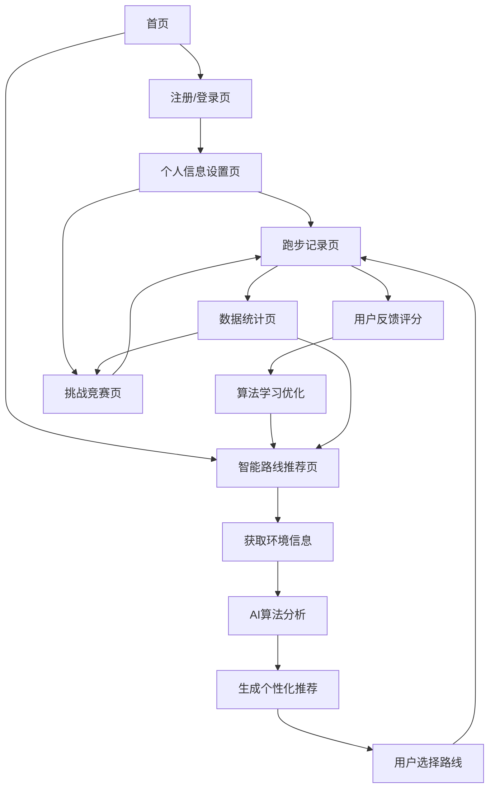

# 上海城市跑 - 产品需求文档

## 1. Product Overview
上海城市跑是一款基于网页端的跑步应用，用户可通过浏览器使用高德地图API实时记录跑步路线、时间和距离，并生成可视化数据。
通过多样化路线探索上海风光，实现娱乐与锻炼的完美结合，让用户在运动中发现城市之美。
项目旨在打造一个集运动记录、路线推荐、数据可视化于一体的城市跑步平台，提升用户的运动体验和城市探索乐趣。

## 2. Core Features

### 2.1 User Roles
| Role | Registration Method | Core Permissions |
|------|---------------------|------------------|
| 普通用户 | 邮箱注册或手机号注册 | 可记录跑步数据、查看个人统计、使用基础路线推荐 |
| 高级用户 | 付费升级或邀请码升级 | 可参与虚拟竞赛、获得高级路线推荐、查看详细数据分析 |

### 2.2 Feature Module
我们的上海城市跑应用包含以下主要页面：
1. **首页**：应用介绍、快速开始跑步、热门路线展示
2. **用户注册/登录页**：用户账户创建和身份验证
3. **个人信息设置页**：基础信息录入、运动偏好配置、兴趣标签选择
4. **跑步记录页**：实时GPS追踪、地图显示、运动数据记录
5. **数据统计页**：历史记录查看、数据可视化图表、成就展示
6. **智能路线推荐页**：基于AI算法的个性化路线推荐、天气时间智能调整、难度分级推荐
7. **挑战竞赛页**：虚拟竞赛参与、排行榜、个人最佳成绩管理

### 2.3 Page Details
| Page Name | Module Name | Feature description |
|-----------|-------------|---------------------|
| 首页 | 导航栏 | 显示应用logo、主要功能入口、用户登录状态 |
| 首页 | 英雄区域 | 展示应用核心价值、快速开始跑步按钮、城市风光背景 |
| 首页 | 热门路线 | 展示推荐跑步路线卡片、路线预览图、基本信息 |
| 用户注册/登录页 | 注册表单 | 邮箱/手机号输入、密码设置、验证码验证 |
| 用户注册/登录页 | 登录表单 | 账号密码登录、记住登录状态、忘记密码链接 |
| 个人信息设置页 | 基础信息 | 身高、体重、年龄输入，用于体能估算和配速建议 |
| 个人信息设置页 | 运动偏好 | 预期跑步距离、时长、配速设置，个性化推荐基础 |
| 个人信息设置页 | 兴趣标签 | 历史建筑、现代艺术、自然风光、市井烟火气等多选标签 |
| 跑步记录页 | 地图显示 | 集成高德地图API，实时显示当前位置和跑步轨迹 |
| 跑步记录页 | 运动控制 | 开始/暂停/结束跑步按钮、实时数据显示 |
| 跑步记录页 | 数据面板 | 实时显示距离、时间、配速、卡路里消耗 |
| 数据统计页 | 历史记录 | 跑步历史列表、筛选和搜索功能 |
| 数据统计页 | 数据图表 | 距离、时间、配速趋势图，周/月/年统计 |
| 数据统计页 | 成就系统 | 里程碑成就、徽章展示、进度条 |
| 智能路线推荐页 | AI推荐引擎 | 基于用户历史数据、偏好、天气、时间的智能推荐算法 |
| 智能路线推荐页 | 个性化推荐 | 根据用户跑步习惯、强度偏好、历史路线分析生成推荐 |
| 智能路线推荐页 | 天气时间调整 | 根据当前天气、时段推荐适合的晨跑、夜跑、室内路线 |
| 智能路线推荐页 | 难度分级系统 | 轻松跑、挑战跑、极限跑三级难度，匹配用户运动目标 |
| 智能路线推荐页 | 路线详情展示 | 路线地图、距离、难度、景点介绍、用户评价、推荐理由 |
| 智能路线推荐页 | 用户反馈学习 | 路线评分、偏好反馈，持续优化推荐算法 |
| 挑战竞赛页 | 竞赛设置 | 虚拟竞赛开关、参赛距离选择 |
| 挑战竞赛页 | 最佳成绩 | 个人最佳成绩录入和管理（不同距离的最佳用时） |
| 挑战竞赛页 | 排行榜 | 周/月排行榜、好友排名、全球排名 |

## 2.4 智能路线推荐系统

### 2.4.1 系统概述
智能路线推荐系统是上海城市跑的核心功能之一，通过AI算法分析用户的历史跑步数据、个人偏好、当前环境因素（天气、时间、位置），为用户提供个性化的路线推荐。系统采用机器学习技术，能够持续学习用户行为，不断优化推荐准确性。

### 2.4.2 推荐算法核心要素

#### 用户画像分析
- **跑步习惯**：常用跑步时间段、频率、持续时长
- **体能水平**：基于历史配速、距离、心率数据评估
- **路线偏好**：喜欢的路线类型、地形、景观特点
- **运动目标**：减脂、增强体能、挑战自我、休闲放松

#### 环境因素感知
- **天气适应性**：
  - 晴天：推荐户外风景路线、公园绿道
  - 雨天：推荐有遮蔽的路线、室内跑步场所
  - 高温：推荐阴凉路线、早晚时段提醒
  - 空气质量：AQI指数影响户外路线推荐
- **时间智能调整**：
  - 晨跑（6:00-9:00）：推荐空气清新、人流较少的路线
  - 夜跑（18:00-21:00）：推荐灯光充足、安全性高的路线
  - 周末：推荐探索性路线、风景优美的长距离路线

#### 难度分级系统
- **轻松跑（1-3级）**：
  - 平坦路面，距离2-5公里
  - 适合初学者或恢复性训练
  - 推荐公园环路、滨江步道
- **挑战跑（4-6级）**：
  - 适度起伏，距离5-10公里
  - 适合有一定基础的跑者
  - 推荐城市绿道、山地公园
- **极限跑（7-10级）**：
  - 高强度路线，距离10公里以上
  - 适合资深跑者和竞赛训练
  - 推荐马拉松路线、山地越野

### 2.4.3 个性化学习机制

#### 用户行为追踪
- 路线完成率统计
- 用户评分和反馈收集
- 跑步数据表现分析
- 路线重复选择频率

#### 算法优化策略
- **协同过滤**：基于相似用户的路线偏好推荐
- **内容过滤**：基于路线特征和用户偏好匹配
- **深度学习**：神经网络分析复杂的用户行为模式
- **强化学习**：根据用户反馈持续优化推荐策略

### 2.4.4 推荐展示界面

#### 智能推荐卡片
- **今日推荐**：基于当前天气、时间的最佳路线
- **个性化推荐**：基于用户历史数据的定制路线
- **挑战推荐**：略高于用户当前水平的进阶路线
- **探索推荐**：用户未尝试过的新路线类型

#### 推荐理由说明
- 明确显示推荐依据（天气适合、难度匹配、风景优美等）
- 预估完成时间和消耗卡路里
- 路线亮点和特色介绍
- 其他用户的评价和建议

## 3. Core Process

### 普通用户流程
用户首先访问首页了解应用功能，然后注册账户并完善个人信息（包括基础信息、运动偏好和兴趣标签）。设置完成后，用户可以开始跑步记录，系统会实时追踪路线并记录数据。跑步结束后，用户可以查看本次运动数据和历史统计。同时，用户可以浏览基于兴趣标签推荐的路线，发现新的跑步路径。

### 高级用户流程
高级用户除了享有普通用户的所有功能外，还可以参与虚拟竞赛。用户需要在挑战竞赛页面设置个人最佳成绩，开启竞赛模式，然后可以查看排行榜并与其他用户竞争。

### 智能路线推荐流程
1. **用户进入推荐页面** → 系统自动获取当前位置、天气、时间信息
2. **AI算法分析** → 结合用户历史数据、偏好设置、环境因素生成推荐
3. **展示推荐结果** → 显示多个推荐路线卡片，包含难度、距离、推荐理由
4. **用户选择路线** → 查看详细信息、开始跑步或收藏路线
5. **跑步完成后** → 用户对路线进行评分反馈，系统学习优化
6. **持续优化** → 算法根据用户行为数据不断调整推荐策略

## 4. User Interface Design

### 4.1 Design Style
- **主色调**：上海蓝 (#1E88E5) 和活力橙 (#FF7043)，体现城市活力和运动激情
- **辅助色**：浅灰 (#F5F5F5) 和深灰 (#424242)，用于背景和文字
- **按钮样式**：圆角矩形按钮，主要按钮使用渐变效果，悬停时有阴影动效
- **字体**：中文使用苹方/微软雅黑，英文使用Roboto，标题18-24px，正文14-16px
- **布局风格**：卡片式设计，顶部导航栏，响应式布局适配移动端
- **图标风格**：线性图标风格，配合少量彩色图标突出重点功能

### 4.2 Page Design Overview

| Page Name | Module Name | UI Elements |
|-----------|-------------|-------------|
| 首页 | 导航栏 | 固定顶部，白色背景，logo左对齐，菜单右对齐，阴影效果 |
| 首页 | 英雄区域 | 全屏背景图（上海城市风光），居中标题和副标题，大号CTA按钮 |
| 首页 | 热门路线 | 3列网格布局，卡片式设计，悬停放大效果，路线缩略图 |
| 个人信息设置页 | 表单区域 | 分步骤表单，进度指示器，输入框圆角设计，标签按钮可多选 |
| 跑步记录页 | 地图容器 | 全屏地图显示，浮动控制面板，半透明背景，圆角设计 |
| 跑步记录页 | 数据面板 | 底部固定，4个数据卡片横向排列，大号数字显示 |
| 数据统计页 | 图表区域 | 响应式图表，渐变色填充，交互式数据点，图例说明 |
| 智能路线推荐页 | 推荐卡片区域 | 大卡片式布局，渐变背景，包含路线图片、难度标签、推荐理由、天气图标 |
| 智能路线推荐页 | 个性化推荐 | 横向滑动卡片，每个卡片显示路线名称、距离、预估时间、难度色彩标识 |
| 智能路线推荐页 | 智能标签 | 动态标签显示推荐依据（如"适合晨跑"、"天气匹配"、"挑战升级"） |
| 智能路线推荐页 | 路线详情 | 全屏地图显示，底部抽屉式详情面板，包含AI推荐理由和用户评价 |
| 智能路线推荐页 | 反馈界面 | 星级评分、快速标签选择、文字评价输入框，简洁易用的反馈收集 |

### 4.3 Responsiveness
应用采用移动优先的响应式设计，主要适配手机端使用场景。在桌面端提供更丰富的数据展示，移动端优化触控操作和单手使用体验。地图交互针对触屏设备进行优化，支持手势缩放和拖拽。