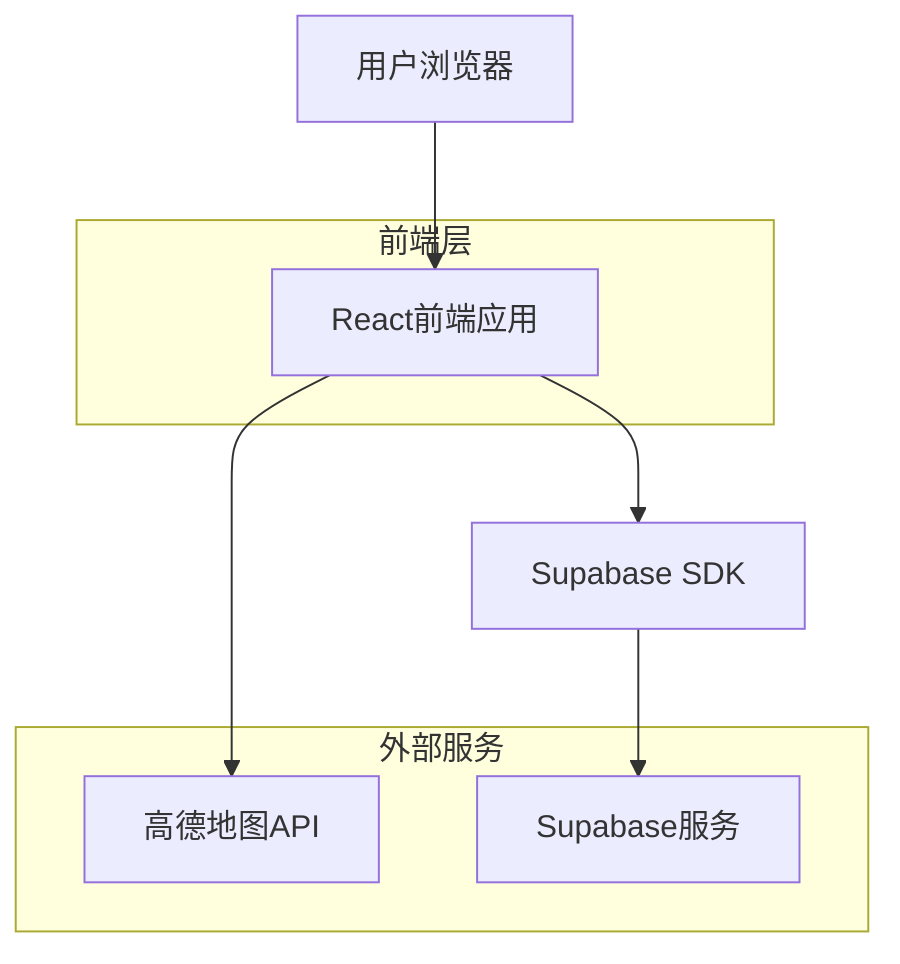
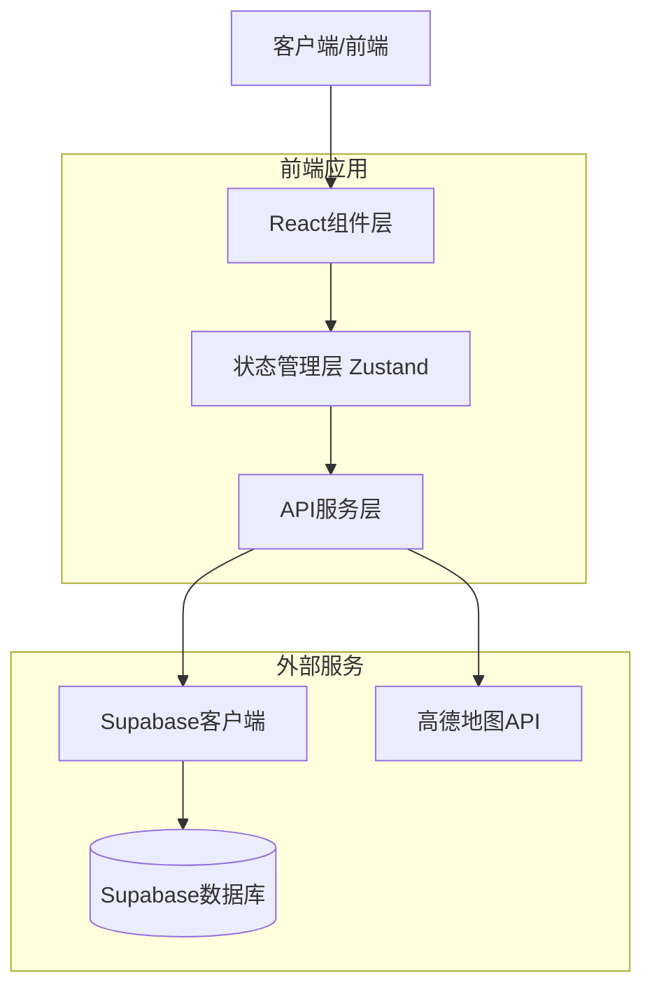
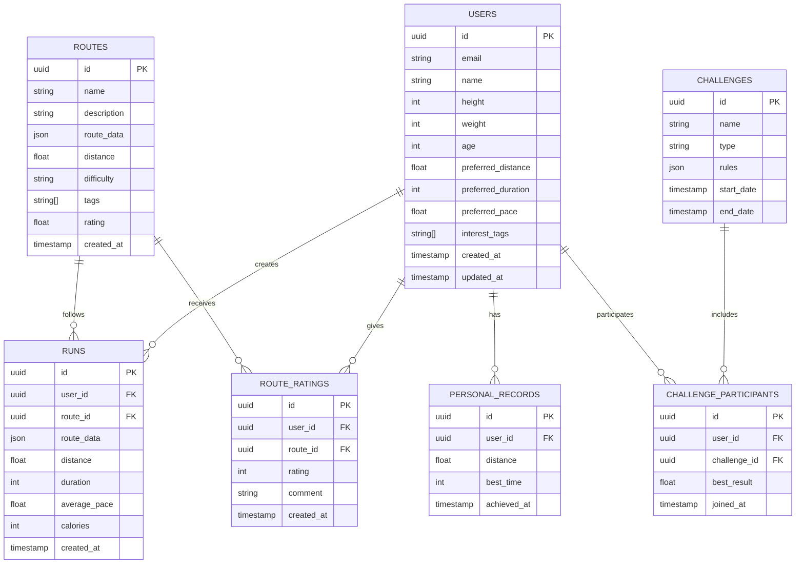

# 上海城市跑 - 技术架构文档

## 1. Architecture design



## 2. Technology Description

* Frontend: React\@18 + TypeScript + Tailwind CSS\@3 + Vite

* Backend: Supabase (认证、数据库、实时功能)

* 地图服务: 高德地图JavaScript API

* 状态管理: Zustand

* 图表库: Chart.js / Recharts

* UI组件: Headless UI + 自定义组件

## 3. Route definitions

| Route       | Purpose            |
| ----------- | ------------------ |
| /           | 首页，展示应用介绍和快速开始入口   |
| /login      | 登录页面，用户身份验证        |
| /register   | 注册页面，新用户账户创建       |
| /profile    | 个人信息设置页，基础信息和偏好配置  |
| /run        | 跑步记录页，实时GPS追踪和数据记录 |
| /stats      | 数据统计页，历史记录和可视化图表   |
| /routes     | 路线推荐页，个性化路线推荐和详情   |
| /challenges | 挑战竞赛页，虚拟竞赛和排行榜     |
| /route/:id  | 路线详情页，特定路线的详细信息    |

## 4. API definitions

### 4.1 Core API

用户认证相关 (通过Supabase Auth)

```
POST /auth/signup
POST /auth/signin
POST /auth/signout
GET /auth/user
```

用户信息管理

```
GET /api/profile
PUT /api/profile
```

Request:

| Param Name          | Param Type | isRequired | Description |
| ------------------- | ---------- | ---------- | ----------- |
| height              | number     | true       | 用户身高(cm)    |
| weight              | number     | true       | 用户体重(kg)    |
| age                 | number     | true       | 用户年龄        |
| preferred\_distance | number     | false      | 预期跑步距离(km)  |
| preferred\_duration | number     | false      | 预期跑步时长(分钟)  |
| preferred\_pace     | number     | false      | 预期配速(分钟/公里) |
| interest\_tags      | string\[]  | false      | 兴趣标签数组      |

跑步记录相关

```
POST /api/runs
GET /api/runs
GET /api/runs/:id
```

Request (创建跑步记录):

| Param Name    | Param Type | isRequired | Description |
| ------------- | ---------- | ---------- | ----------- |
| route\_data   | object     | true       | GPS轨迹数据     |
| distance      | number     | true       | 跑步距离(km)    |
| duration      | number     | true       | 跑步时长(秒)     |
| average\_pace | number     | true       | 平均配速        |
| calories      | number     | false      | 消耗卡路里       |

路线推荐相关

```
GET /api/routes/recommended
GET /api/routes/:id
POST /api/routes/:id/rating
```

挑战竞赛相关

```
GET /api/challenges
POST /api/personal-records
GET /api/leaderboard
```

## 5. Server architecture diagram



## 6. Data model

### 6.1 Data model definition



### 6.2 Data Definition Language

用户表 (users)

```sql
-- 创建用户表
CREATE TABLE users (
    id UUID PRIMARY KEY DEFAULT gen_random_uuid(),
    email VARCHAR(255) UNIQUE NOT NULL,
    name VARCHAR(100) NOT NULL,
    height INTEGER,
    weight INTEGER,
    age INTEGER,
    preferred_distance FLOAT,
    preferred_duration INTEGER,
    preferred_pace FLOAT,
    interest_tags TEXT[],
    created_at TIMESTAMP WITH TIME ZONE DEFAULT NOW(),
    updated_at TIMESTAMP WITH TIME ZONE DEFAULT NOW()
);

-- 创建索引
CREATE INDEX idx_users_email ON users(email);

-- 设置权限
GRANT SELECT ON users TO anon;
GRANT ALL PRIVILEGES ON users TO authenticated;
```

跑步记录表 (runs)

```sql
-- 创建跑步记录表
CREATE TABLE runs (
    id UUID PRIMARY KEY DEFAULT gen_random_uuid(),
    user_id UUID REFERENCES users(id) ON DELETE CASCADE,
    route_id UUID REFERENCES routes(id) ON DELETE SET NULL,
    route_data JSONB NOT NULL,
    distance FLOAT NOT NULL,
    duration INTEGER NOT NULL,
    average_pace FLOAT NOT NULL,
    calories INTEGER,
    created_at TIMESTAMP WITH TIME ZONE DEFAULT NOW()
);

-- 创建索引
CREATE INDEX idx_runs_user_id ON runs(user_id);
CREATE INDEX idx_runs_created_at ON runs(created_at DESC);

-- 设置权限
GRANT SELECT ON runs TO anon;
GRANT ALL PRIVILEGES ON runs TO authenticated;
```

路线表 (routes)

```sql
-- 创建路线表
CREATE TABLE routes (
    id UUID PRIMARY KEY DEFAULT gen_random_uuid(),
    name VARCHAR(255) NOT NULL,
    description TEXT,
    route_data JSONB NOT NULL,
    distance FLOAT NOT NULL,
    difficulty VARCHAR(20) CHECK (difficulty IN ('easy', 'medium', 'hard')),
    tags TEXT[],
    rating FLOAT DEFAULT 0,
    created_at TIMESTAMP WITH TIME ZONE DEFAULT NOW()
);

-- 创建索引
CREATE INDEX idx_routes_tags ON routes USING GIN(tags);
CREATE INDEX idx_routes_difficulty ON routes(difficulty);
CREATE INDEX idx_routes_rating ON routes(rating DESC);

-- 设置权限
GRANT SELECT ON routes TO anon;
GRANT ALL PRIVILEGES ON routes TO authenticated;
```

个人最佳记录表 (personal\_records)

```sql
-- 创建个人最佳记录表
CREATE TABLE personal_records (
    id UUID PRIMARY KEY DEFAULT gen_random_uuid(),
    user_id UUID REFERENCES users(id) ON DELETE CASCADE,
    distance FLOAT NOT NULL,
    best_time INTEGER NOT NULL,
    achieved_at TIMESTAMP WITH TIME ZONE DEFAULT NOW(),
    UNIQUE(user_id, distance)
);

-- 创建索引
CREATE INDEX idx_personal_records_user_id ON personal_records(user_id);

-- 设置权限
GRANT SELECT ON personal_records TO anon;
GRANT ALL PRIVILEGES ON personal_records TO authenticated;
```

路线评分表 (route\_ratings)

```sql
-- 创建路线评分表
CREATE TABLE route_ratings (
    id UUID PRIMARY KEY DEFAULT gen_random_uuid(),
    user_id UUID REFERENCES users(id) ON DELETE CASCADE,
    route_id UUID REFERENCES routes(id) ON DELETE CASCADE,
    rating INTEGER CHECK (rating >= 1 AND rating <= 5),
    comment TEXT,
    created_at TIMESTAMP WITH TIME ZONE DEFAULT NOW(),
    UNIQUE(user_id, route_id)
);

-- 创建索引
CREATE INDEX idx_route_ratings_route_id ON route_ratings(route_id);

-- 设置权限
GRANT SELECT ON route_ratings TO anon;
GRANT ALL PRIVILEGES ON route_ratings TO authenticated;
```

挑战赛表 (challenges)

```sql
-- 创建挑战赛表
CREATE TABLE challenges (
    id UUID PRIMARY KEY DEFAULT gen_random_uuid(),
    name VARCHAR(255) NOT NULL,
    type VARCHAR(50) NOT NULL,
    rules JSONB NOT NULL,
    start_date TIMESTAMP WITH TIME ZONE NOT NULL,
    end_date TIMESTAMP WITH TIME ZONE NOT NULL,
    created_at TIMESTAMP WITH TIME ZONE DEFAULT NOW()
);

-- 设置权限
GRANT SELECT ON challenges TO anon;
GRANT ALL PRIVILEGES ON challenges TO authenticated;
```

挑战赛参与者表 (challenge\_participants)

```sql
-- 创建挑战赛参与者表
CREATE TABLE challenge_participants (
    id UUID PRIMARY KEY DEFAULT gen_random_uuid(),
    user_id UUID REFERENCES users(id) ON DELETE CASCADE,
    challenge_id UUID REFERENCES challenges(id) ON DELETE CASCADE,
    best_result FLOAT,
    joined_at TIMESTAMP WITH TIME ZONE DEFAULT NOW(),
    UNIQUE(user_id, challenge_id)
);

-- 创建索引
CREATE INDEX idx_challenge_participants_challenge_id ON challenge_participants(challenge_id);
CREATE INDEX idx_challenge_participants_best_result ON challenge_participants(best_result DESC);

-- 设置权限
GRANT SELECT ON challenge_participants TO anon;
GRANT ALL PRIVILEGES ON challenge_participants TO authenticated;
```

\-- 初始化路线数据

```sql
INSERT INTO routes (name, description, route_data, distance, difficulty, tags) VALUES
('外滩经典路线', '沿黄浦江畔欣赏万国建筑博览群', '{"coordinates": []}', 5.2, 'easy', ARRAY['历史建筑', '江景']),
('世纪公园环湖', '在城市绿肺中享受自然跑步体验', '{"coordinates": []}', 3.8, 'easy', ARRAY['自然风光', '公园']),
('田子坊文化路线', '穿梭在石库门弄堂感受海派文化', '{"coordinates": []}', 2.5, 'medium', ARRAY['市井烟火气', '历史建筑']),
('陆家嘴摩天路线', '在现代都市森林中挑战自我', '{"coordinates": []}', 6.0, 'hard', ARRAY['现代艺术', '城市景观']);
```

