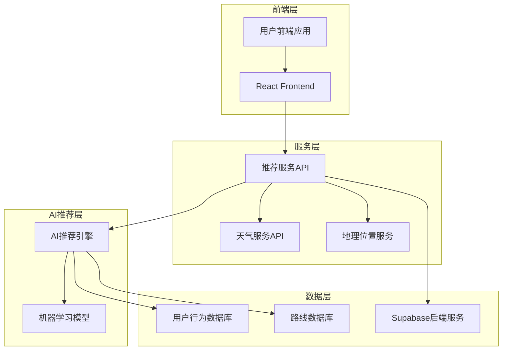
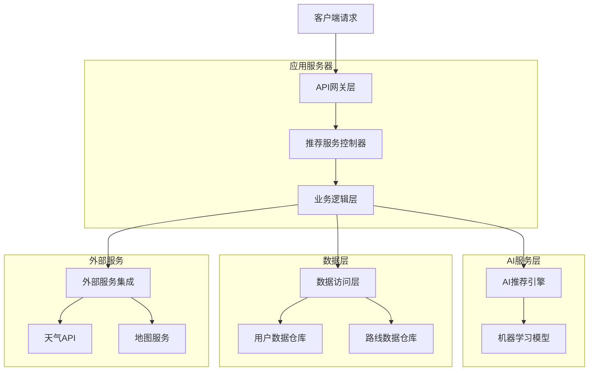
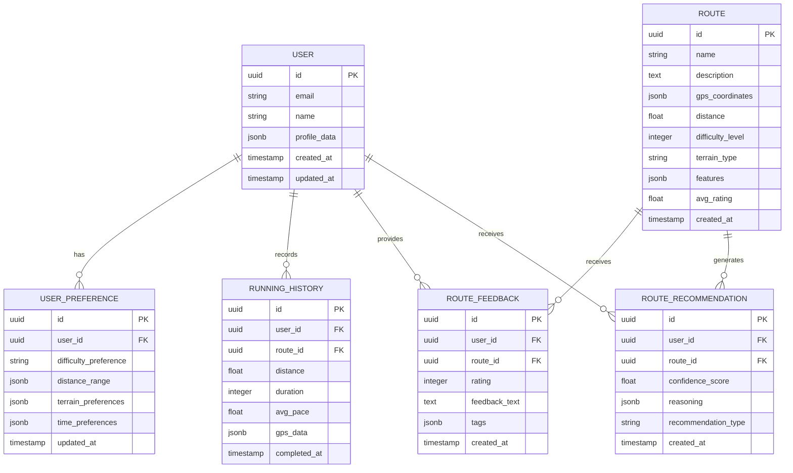
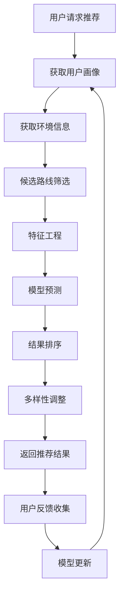

# 上海城市跑 - 智能路线推荐系统技术架构文档

## 1. Architecture design



## 2. Technology Description

- Frontend: React@18 + TypeScript + TailwindCSS + Vite
- Backend: Node.js + Express + Supabase
- AI/ML: TensorFlow.js + Python (推荐算法服务)
- Database: Supabase (PostgreSQL)
- External APIs: 天气API、地图服务API
- Caching: Redis (推荐结果缓存)

## 3. Route definitions

| Route | Purpose |
|-------|---------|
| /recommendations | 智能路线推荐主页面 |
| /recommendations/ai | AI个性化推荐页面 |
| /recommendations/weather | 基于天气的推荐页面 |
| /recommendations/difficulty/:level | 按难度分级的推荐页面 |
| /route/:id | 路线详情页面 |
| /feedback/:routeId | 路线反馈评价页面 |

## 4. API definitions

### 4.1 智能推荐API

获取个性化路线推荐
```
POST /api/recommendations/personalized
```

Request:
| Param Name | Param Type | isRequired | Description |
|------------|------------|------------|-------------|
| userId | string | true | 用户ID |
| location | object | true | 当前位置坐标 |
| preferences | object | false | 用户偏好设置 |
| weatherCondition | string | false | 当前天气状况 |
| timeOfDay | string | false | 当前时间段 |

Response:
| Param Name | Param Type | Description |
|------------|------------|-------------|
| recommendations | array | 推荐路线列表 |
| reasoning | array | 推荐理由说明 |
| confidence | number | 推荐置信度 |

Example:
```json
{
  "userId": "user123",
  "location": {
    "latitude": 31.2304,
    "longitude": 121.4737
  },
  "preferences": {
    "difficulty": "moderate",
    "distance": "5-10km",
    "terrain": "park"
  },
  "weatherCondition": "sunny",
  "timeOfDay": "morning"
}
```

### 4.2 用户反馈API

提交路线评价反馈
```
POST /api/feedback/route
```

Request:
| Param Name | Param Type | isRequired | Description |
|------------|------------|------------|-------------|
| userId | string | true | 用户ID |
| routeId | string | true | 路线ID |
| rating | number | true | 评分(1-5) |
| feedback | string | false | 文字反馈 |
| tags | array | false | 快速标签 |

Response:
| Param Name | Param Type | Description |
|------------|------------|-------------|
| success | boolean | 提交状态 |
| message | string | 响应消息 |

### 4.3 天气集成API

获取当前天气信息
```
GET /api/weather/current
```

Request:
| Param Name | Param Type | isRequired | Description |
|------------|------------|------------|-------------|
| latitude | number | true | 纬度 |
| longitude | number | true | 经度 |

Response:
| Param Name | Param Type | Description |
|------------|------------|-------------|
| temperature | number | 当前温度 |
| condition | string | 天气状况 |
| humidity | number | 湿度 |
| aqi | number | 空气质量指数 |

## 5. Server architecture diagram



## 6. Data model

### 6.1 Data model definition



### 6.2 Data Definition Language

用户偏好表 (user_preferences)
```sql
-- 创建用户偏好表
CREATE TABLE user_preferences (
    id UUID PRIMARY KEY DEFAULT gen_random_uuid(),
    user_id UUID NOT NULL REFERENCES auth.users(id),
    difficulty_preference VARCHAR(20) DEFAULT 'moderate' CHECK (difficulty_preference IN ('easy', 'moderate', 'hard')),
    distance_range JSONB DEFAULT '{"min": 2, "max": 10}',
    terrain_preferences JSONB DEFAULT '["park", "street", "trail"]',
    time_preferences JSONB DEFAULT '["morning", "evening"]',
    weather_preferences JSONB DEFAULT '{"avoid_rain": true, "prefer_cool": true}',
    updated_at TIMESTAMP WITH TIME ZONE DEFAULT NOW()
);

-- 创建路线表
CREATE TABLE routes (
    id UUID PRIMARY KEY DEFAULT gen_random_uuid(),
    name VARCHAR(255) NOT NULL,
    description TEXT,
    gps_coordinates JSONB NOT NULL,
    distance FLOAT NOT NULL,
    difficulty_level INTEGER CHECK (difficulty_level BETWEEN 1 AND 10),
    terrain_type VARCHAR(50),
    features JSONB DEFAULT '{}',
    avg_rating FLOAT DEFAULT 0,
    total_ratings INTEGER DEFAULT 0,
    created_at TIMESTAMP WITH TIME ZONE DEFAULT NOW(),
    updated_at TIMESTAMP WITH TIME ZONE DEFAULT NOW()
);

-- 创建跑步历史表
CREATE TABLE running_history (
    id UUID PRIMARY KEY DEFAULT gen_random_uuid(),
    user_id UUID NOT NULL REFERENCES auth.users(id),
    route_id UUID REFERENCES routes(id),
    distance FLOAT NOT NULL,
    duration INTEGER NOT NULL, -- 秒
    avg_pace FLOAT, -- 分钟/公里
    max_speed FLOAT,
    calories_burned INTEGER,
    gps_data JSONB,
    weather_condition VARCHAR(50),
    completed_at TIMESTAMP WITH TIME ZONE DEFAULT NOW()
);

-- 创建路线反馈表
CREATE TABLE route_feedback (
    id UUID PRIMARY KEY DEFAULT gen_random_uuid(),
    user_id UUID NOT NULL REFERENCES auth.users(id),
    route_id UUID NOT NULL REFERENCES routes(id),
    rating INTEGER CHECK (rating BETWEEN 1 AND 5),
    feedback_text TEXT,
    tags JSONB DEFAULT '[]',
    helpful_count INTEGER DEFAULT 0,
    created_at TIMESTAMP WITH TIME ZONE DEFAULT NOW()
);

-- 创建推荐记录表
CREATE TABLE route_recommendations (
    id UUID PRIMARY KEY DEFAULT gen_random_uuid(),
    user_id UUID NOT NULL REFERENCES auth.users(id),
    route_id UUID NOT NULL REFERENCES routes(id),
    confidence_score FLOAT CHECK (confidence_score BETWEEN 0 AND 1),
    reasoning JSONB NOT NULL,
    recommendation_type VARCHAR(50) NOT NULL,
    weather_factor JSONB,
    time_factor VARCHAR(20),
    user_clicked BOOLEAN DEFAULT FALSE,
    user_completed BOOLEAN DEFAULT FALSE,
    created_at TIMESTAMP WITH TIME ZONE DEFAULT NOW()
);

-- 创建索引
CREATE INDEX idx_user_preferences_user_id ON user_preferences(user_id);
CREATE INDEX idx_running_history_user_id ON running_history(user_id);
CREATE INDEX idx_running_history_completed_at ON running_history(completed_at DESC);
CREATE INDEX idx_route_feedback_route_id ON route_feedback(route_id);
CREATE INDEX idx_route_feedback_rating ON route_feedback(rating);
CREATE INDEX idx_routes_difficulty ON routes(difficulty_level);
CREATE INDEX idx_routes_distance ON routes(distance);
CREATE INDEX idx_recommendations_user_id ON route_recommendations(user_id);
CREATE INDEX idx_recommendations_created_at ON route_recommendations(created_at DESC);

-- 设置RLS策略
ALTER TABLE user_preferences ENABLE ROW LEVEL SECURITY;
ALTER TABLE running_history ENABLE ROW LEVEL SECURITY;
ALTER TABLE route_feedback ENABLE ROW LEVEL SECURITY;
ALTER TABLE route_recommendations ENABLE ROW LEVEL SECURITY;

-- 用户只能访问自己的数据
CREATE POLICY "Users can view own preferences" ON user_preferences FOR SELECT USING (auth.uid() = user_id);
CREATE POLICY "Users can update own preferences" ON user_preferences FOR UPDATE USING (auth.uid() = user_id);
CREATE POLICY "Users can view own history" ON running_history FOR SELECT USING (auth.uid() = user_id);
CREATE POLICY "Users can insert own history" ON running_history FOR INSERT WITH CHECK (auth.uid() = user_id);

-- 路线表公开可读
GRANT SELECT ON routes TO anon, authenticated;
GRANT ALL ON user_preferences, running_history, route_feedback, route_recommendations TO authenticated;

-- 初始化示例路线数据
INSERT INTO routes (name, description, gps_coordinates, distance, difficulty_level, terrain_type, features) VALUES
('外滩滨江步道', '沿黄浦江的经典跑步路线，可欣赏浦江两岸美景', 
 '[{"lat": 31.2304, "lng": 121.4737}, {"lat": 31.2404, "lng": 121.4837}]', 
 5.2, 3, 'waterfront', '{"scenic": true, "flat": true, "lighting": "good"}'),
('世纪公园环路', '上海最大的城市公园内的跑步环路，绿树成荫', 
 '[{"lat": 31.2072, "lng": 121.5533}, {"lat": 31.2172, "lng": 121.5633}]', 
 3.8, 2, 'park', '{"green": true, "peaceful": true, "air_quality": "excellent"}'),
('陆家嘴金融区', '现代化商务区跑步路线，高楼林立的都市风光', 
 '[{"lat": 31.2352, "lng": 121.5057}, {"lat": 31.2452, "lng": 121.5157}]', 
 4.5, 4, 'urban', '{"modern": true, "challenging": true, "night_view": "spectacular"}');
```

## 7. AI推荐算法架构

### 7.1 机器学习模型设计

#### 用户画像模型
- **输入特征**：历史跑步数据、偏好设置、完成率、评分行为
- **输出**：用户兴趣向量、体能水平评估、偏好权重
- **算法**：协同过滤 + 深度神经网络

#### 路线匹配模型
- **输入特征**：用户画像、当前环境（天气、时间、位置）、路线特征
- **输出**：匹配度评分、推荐置信度
- **算法**：梯度提升树 + 注意力机制

#### 实时优化模型
- **输入特征**：用户实时反馈、完成情况、评分数据
- **输出**：模型参数调整、推荐策略优化
- **算法**：在线学习 + 强化学习

### 7.2 推荐系统流程

